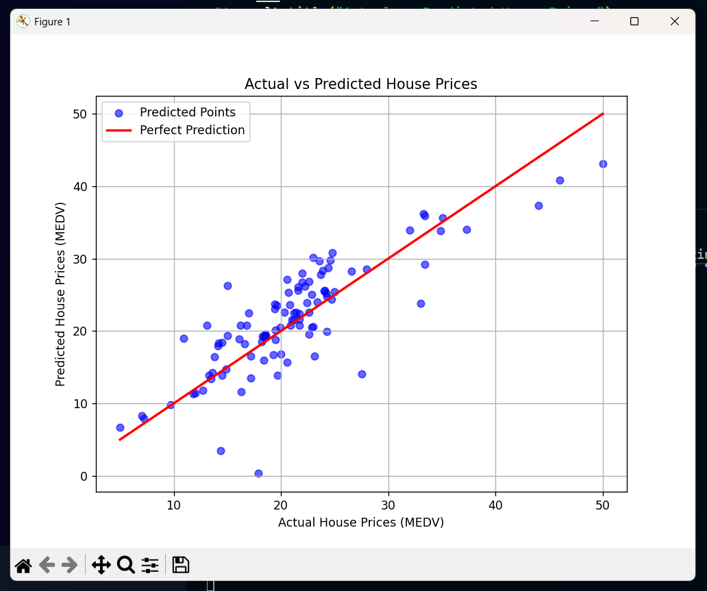

The dataset i took was from kaggle 
dataset link https://www.kaggle.com/datasets/vikrishnan/boston-house-prices 

columns in this dataset denote

    "CRIM",      # Crime rate per capita by town
    "ZN",        # Proportion of residential land zoned for lots over 25,000 sq. ft.
    "INDUS",     # Non-retail business acres proportion
    "CHAS",      # Charles River dummy variable (1 if near river, else 0)
    "NOX",       # Nitric oxide concentration
    "RM",        # Average number of rooms per dwelling
    "AGE",       # % of owner-occupied units built before 1940
    "DIS",       # Distance to employment centers
    "RAD",       # Accessibility to radial highways
    "TAX",       # Property tax rate per $10,000
    "PTRATIO",   # Pupil-teacher ratio by town
    "B",         # 1000(Bk - 0.63)^2 (Bk = proportion of Black residents)
    "LSTAT",     # % lower status of the population
    "MEDV"       # Median value of owner-occupied homes ($1000s) [TARGET]

i used linear regression on this dataset to predict the housing prices based on these features 

Mean Absolute Error : 3.1867873980180996  
R2 score : 0.6522201888666173

and how much the prediction varies on which factors 

        Feature  Coefficient
    5        RM     4.088551
    3      CHAS     2.487155
    8       RAD     0.296234
    1        ZN     0.035509
    2     INDUS     0.020186
    11        B     0.012065
    6       AGE     0.008370
    9       TAX    -0.011453
    0      CRIM    -0.098642
    12    LSTAT    -0.554132
    10  PTRATIO    -1.001762
    7       DIS    -1.464057
    4       NOX   -18.040457

